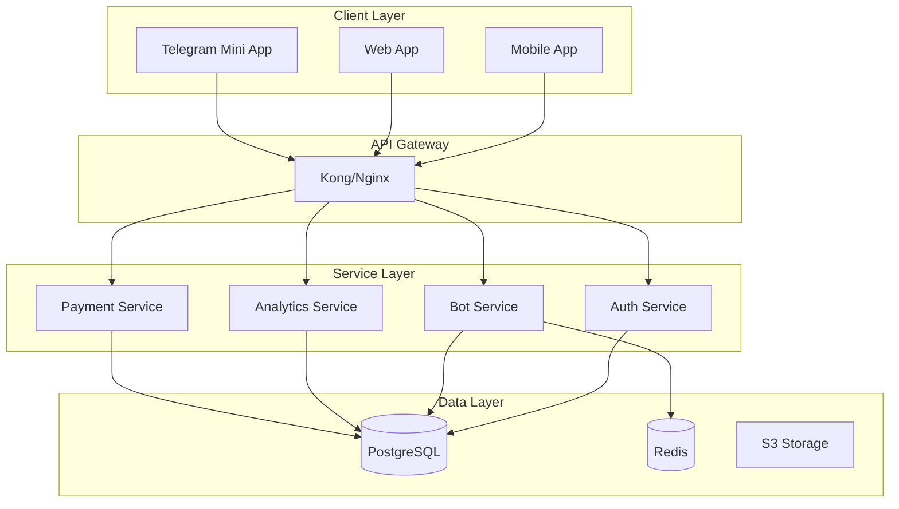

# GAVATCore Enterprise Architecture

## 🏗️ Enterprise-Grade Klasör Yapısı

```
gavatcore/
├── apis/                      # Tüm API servisleri
│   ├── character_api_server.py
│   ├── production_bot_api.py
│   ├── xp_token_api.py
│   ├── real_bot_management_api.py
│   └── ...
│
├── services/                  # Platform-specific servisler
│   ├── telegram/             # Telegram bot servisleri
│   │   ├── handlers/         # Message handlers
│   │   ├── bots/            # Bot implementations
│   │   └── utils/           # Telegram utilities
│   ├── discord/             # Discord entegrasyonu
│   └── whatsapp/            # WhatsApp Business API
│
├── modules/                  # Core business modülleri
│   ├── auth/                # Authentication & Authorization
│   ├── analytics/           # Analytics & Monitoring
│   └── payments/            # Payment processing
│
├── infrastructure/          # DevOps & Infrastructure
│   ├── docker/             # Docker configurations
│   ├── kubernetes/         # K8s manifests
│   └── terraform/          # Infrastructure as Code
│
├── gavatcore_panel/        # Unified Management Panel
│   ├── lib/               # Flutter application
│   ├── web/               # Web configurations
│   └── assets/            # Static resources
│
├── core/                   # Core engine & utilities
│   ├── db/                # Database models
│   ├── engines/           # Business logic engines
│   └── utils/             # Shared utilities
│
├── data/                   # Data & Storage
│   ├── analytics/         # Analytics data
│   ├── personas/          # Character personas
│   └── templates/         # Message templates
│
├── tests/                  # Test suites
│   ├── unit/             # Unit tests
│   ├── integration/      # Integration tests
│   └── e2e/              # End-to-end tests
│
└── docs/                   # Documentation
    ├── api/              # API documentation
    ├── guides/           # Development guides
    └── architecture/     # Architecture docs
```

## 🔧 Key Improvements

### 1. **Unified API Layer**
- Tüm API'ler `apis/` klasöründe
- RESTful ve GraphQL desteği
- API Gateway pattern

### 2. **Service-Oriented Architecture**
- Platform-specific kodlar `services/` altında
- Loose coupling between services
- Easy to add new platforms

### 3. **Modular Business Logic**
- Core business logic in `modules/`
- Reusable across different services
- Clear separation of concerns

### 4. **Infrastructure as Code**
- Docker, K8s, Terraform configs organized
- Easy deployment and scaling
- Environment-specific configurations

### 5. **Unified Panel**
- Single Flutter app for all platforms
- Web, Mobile, and Telegram Mini App
- Shared codebase, platform-specific features

## 🚀 Technology Stack

### Backend
- **Python 3.11+**: Core backend
- **FastAPI**: High-performance APIs
- **PostgreSQL**: Primary database
- **Redis**: Caching & sessions
- **RabbitMQ**: Message queue

### Frontend
- **Flutter 3.0+**: Cross-platform UI
- **Riverpod**: State management
- **Dio + Retrofit**: API integration

### Infrastructure
- **Docker**: Containerization
- **Kubernetes**: Orchestration
- **Terraform**: Infrastructure provisioning
- **GitHub Actions**: CI/CD

### Monitoring
- **Prometheus**: Metrics collection
- **Grafana**: Visualization
- **ELK Stack**: Logging
- **Sentry**: Error tracking

## 📊 System Architecture



## 🔒 Security Architecture

### Authentication
- OAuth 2.0 + JWT
- Telegram Login Widget
- Biometric authentication
- 2FA support

### Authorization
- Role-Based Access Control (RBAC)
- API key management
- Rate limiting
- IP whitelisting

### Data Security
- End-to-end encryption
- At-rest encryption
- TLS 1.3
- Regular security audits

## 📈 Scalability

### Horizontal Scaling
- Microservices architecture
- Container orchestration
- Load balancing
- Auto-scaling policies

### Performance
- Redis caching
- Database indexing
- CDN for static assets
- Query optimization

### High Availability
- Multi-region deployment
- Database replication
- Health checks
- Disaster recovery

## 🛠️ Development Workflow

### Local Development
```bash
# Start all services
docker-compose up -d

# Run specific service
python -m services.telegram.main

# Run tests
pytest tests/
```

### Deployment
```bash
# Build Docker images
docker build -t gavatcore/api .

# Deploy to Kubernetes
kubectl apply -f infrastructure/kubernetes/

# Update infrastructure
terraform apply
```

## 📱 Panel Features

### Core Features
- **Multi-platform**: iOS, Android, Web, Telegram
- **Real-time**: WebSocket connections
- **Offline-first**: Local data sync
- **Multi-language**: i18n support

### Business Features
- Bot management
- Analytics dashboard
- User management
- Payment processing
- Character AI management

## 🎯 Best Practices

### Code Organization
- Domain-Driven Design (DDD)
- Clean Architecture
- SOLID principles
- Design patterns

### Testing
- Test-Driven Development (TDD)
- 80%+ code coverage
- E2E test automation
- Performance testing

### Documentation
- API documentation (OpenAPI)
- Code documentation
- Architecture diagrams
- Deployment guides

## 🚦 Monitoring & Observability

### Metrics
- Response time
- Error rate
- Throughput
- Resource usage

### Logging
- Structured logging
- Log aggregation
- Real-time analysis
- Alerting

### Tracing
- Distributed tracing
- Performance profiling
- Bottleneck identification
- User journey tracking

## 📅 Roadmap

### Phase 1: Foundation (Current)
- ✅ Unified architecture
- ✅ Core services
- ✅ Basic panel
- ✅ CI/CD pipeline

### Phase 2: Enhancement
- 🔄 Advanced analytics
- 🔄 AI improvements
- 🔄 Payment integration
- 🔄 Multi-region support

### Phase 3: Scale
- 📅 Global CDN
- 📅 Advanced caching
- 📅 GraphQL API
- 📅 Blockchain integration

### Phase 4: Enterprise
- 📅 White-label solution
- 📅 SaaS platform
- 📅 Marketplace
- 📅 API ecosystem

---

*This document represents the enterprise-grade architecture of GAVATCore platform.* 